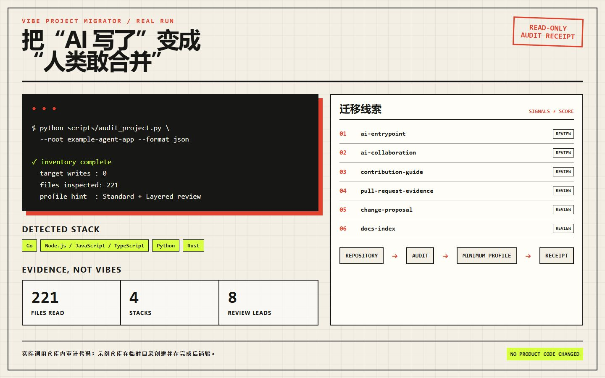

<div align="center">

# Vibe Project Migrator

**把“AI 写了”迁移成“人类敢合并”。**

[](#安装)
[](#独立审计脚本)
[](#独立审计脚本)
[](LICENSE)

把一个已有软件仓库迁移为“AI 可以快速理解、人类可以放心评审、变更可以复现验证”的工程协作体系。

</div>

它不是一套需要原样照搬的文档模板，也不会自动重写产品代码。技能会先只读审计目标仓库，再根据项目规模、技术栈、现有约定和风险，选择最小够用的治理层级，补齐 `AGENTS.md`、AI 协作规则、变更提案、PR/Issue 模板、验证回执和对外接受度材料。



<p align="center"><sub>真实使用截图：仓库内审计代码扫描一个临时示例工程，识别 221 个文件、4 类技术栈和 8 条迁移线索；目标工程写入为 0。可运行 <code>python docs/demo/render_usage_demo.py</code> 复现。</sub></p>

## 30 秒看懂

| 输入 | Skill 做什么 | 交付什么 |
|---|---|---|
| 一个已有软件仓库 | 只读识别技术栈、Git 状态、现有规则、CI、文档和风险信号 | 不带“合规打分”的项目画像 |
| “把它改造成可持续的 Vibe Coding 工程” | 选择 Baseline / Standard / Layered，按项目事实补最少够用的材料 | AI 入口、评审证据、变更提案、验证与回滚约定 |
| “团队为什么要接受这些改动” | 把速度、风险和人工复核边界写成人能审查的说明 | 迁移回执、未采用项、真实命令与人工待办 |

## 为什么需要这个 Skill

自然语言编程显著降低了“写出代码”的门槛，但没有自动解决下面的问题：

- AI 每次进入仓库都重新猜测架构、命令和边界；
- 设计依据停留在聊天记录里，其他人无法接手或推翻；
- 生成速度超过评审速度，PR 很大却讲不清用户价值；
- “测试通过”没有对应命令、结果和未覆盖范围；
- 删除、发布、凭据、生产环境等授权边界容易被含糊处理；
- 不同 AI 工具各用一套提示词，项目事实逐渐分叉；
- 维护者不是反对 AI，而是不愿接受无法审查、无法回滚的 AI 产出。

这个 Skill 的必要性，在于把临时对话变成仓库内的长期工程契约：AI 获得稳定上下文，人类获得明确的范围、风险和证据。目标是减少重复沟通和返工，而不是增加形式主义。

## 核心功能

| 能力 | 作用 |
|---|---|
| 只读仓库审计 | 识别技术栈、Git 状态、现有 AI 入口、文档、CI 和评审模板，不修改目标项目 |
| 项目画像 | 区分小型项目、活跃产品和多模块仓库；风险级别与目录规模分开判断 |
| 规则迁移 | 创建或整合根级、子目录级 `AGENTS.md`，保留项目自身语言和权威文档 |
| 分级变更流程 | L0 小改动保持轻量；L1 记录根因与测试；L2 记录备选、风险、回滚和验收 |
| 评审证据 | PR 模板要求用户价值、范围、实际执行命令、结果、AI 参与和人工复核范围 |
| 文档治理 | 建立面向读者的文档索引、权威来源和变更同步规则，避免多套事实源 |
| 接受度改造 | 帮助 README 先讲问题和价值，再展示安全边界、可复现证据与使用方式 |
| 迁移回执 | 汇总选择的层级、文件变化、适配决策、未采用项、验证结果和人工待办 |

## 不会做什么

- 不把某个参考工程的产品名、人员、内部地址、构建命令或技术红线复制到其他项目。
- 默认不改变产品逻辑、依赖、发布方式、Git 历史、仓库可见性或外部系统。
- 不把缺少某个固定文件等同于“不合规”，也不输出没有依据的精确评分。
- 不要求每个小改动都写完整设计文档，不为小项目制造大型企业目录树。
- 不替人批准安全敏感操作，也不把 AI 自己的判断当成人工评审。

## 迁移层级

### Baseline

适合小型或早期项目：AI 入口、贡献与验证命令、AI 协作边界、PR 证据。

### Standard

适合持续开发的产品：在 Baseline 上按需增加文档索引、变更提案、Issue 表单、安全报告和决策追踪。

### Layered

适合 monorepo 或多领域工程：只在构建方式、模块边界、生成文件或安全规则确实不同的子树增加最近层级 `AGENTS.md`。

一个代码量很小但会删除数据的工具，可能只需要 Baseline 文件数量，却需要 L2 级别的风险与回滚证据。

## 工作流

```text
只读审计
  → 确认现有权威来源与未提交改动
  → 选择 Baseline / Standard / Layered
  → 生成逐文件迁移方案与明确非目标
  → 按项目事实创建或整合协作材料
  → 运行链接、配置、格式、测试、构建等相关验证
  → 输出迁移回执与人工复核项
```

## 安装

可以让 Codex 使用 `skill-installer` 从本仓库安装：

```text
Install the skill from https://github.com/carpentry-liu/vibe-project-migrator
```

也可以安装到单个项目，不影响其他仓库：

```powershell
git clone https://github.com/carpentry-liu/vibe-project-migrator.git .agents\skills\vibe-project-migrator
```

## 使用

只做审计，不修改项目：

```text
Use $vibe-project-migrator to audit this repository and recommend the smallest useful migration profile. Do not edit files.
```

执行完整迁移：

```text
Use $vibe-project-migrator to migrate this repository to an evidence-driven AI collaboration workflow. Preserve product behavior and existing conventions, verify the result, and show me the migration receipt.
```

针对公开项目提升接受度：

```text
Use $vibe-project-migrator to improve this repository's AI governance, contributor onboarding, and README trust narrative without changing application behavior.
```

## 独立审计脚本

技能附带一个仅使用 Python 标准库的只读审计脚本：

```powershell
python scripts\audit_project.py --root D:\path\to\repository --format markdown
python scripts\audit_project.py --root D:\path\to\repository --format json
```

输出是迁移线索而不是合规评分。脚本不会读取文件内容，不跟随符号链接，并跳过 `.git`、`node_modules`、`target`、`build`、`vendor` 等常见大型目录。

## 迁移前后

| 迁移前 | 迁移后 |
|---|---|
| 构建和测试命令存在于记忆或聊天中 | 命令来自仓库配置并写入贡献与 AI 入口 |
| 非平凡需求直接进入代码 | 范围、备选、风险、回滚和验收可以独立评审 |
| PR 只写“测试通过” | PR 给出实际命令、结果和未覆盖项 |
| 每个 AI 重新建立上下文 | 根级与子树规则路由到同一组权威事实 |
| 维护者难以判断 AI 产出可信度 | AI 参与、人工复核范围和限制保持透明 |

## 仓库结构

```text
SKILL.md                         技能入口与执行边界
agents/openai.yaml              Codex 展示与默认调用信息
scripts/audit_project.py        只读仓库审计
references/migration-playbook.md 迁移决策流程
references/artifact-blueprints.md 协作材料内容契约
references/adoption-guide.md    对外介绍与接受度指南
tests/                          审计脚本行为测试
```

## 验证

```powershell
python -m unittest discover -s tests -v
python scripts\audit_project.py --root . --format json
```

技能结构使用 Codex `skill-creator` 的 `quick_validate.py` 校验。

## 设计原则

- 项目适配优先于模板一致。
- 证据优先于信心表达。
- 风险决定流程深度，代码量不决定。
- 文档是上下文入口，不是代码现状的重复数据库。
- 迁移默认只改变协作材料，不改变产品行为。
- 外部写操作和高风险动作始终需要明确授权。

## License

[MIT](LICENSE)
